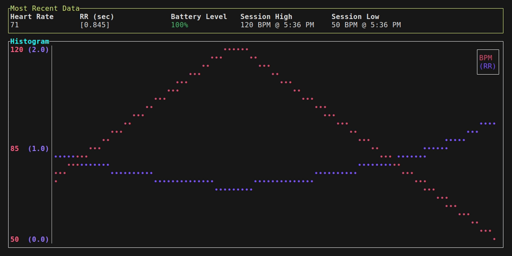

[](https://github.com/nullstalgia/null_iron_heart/actions/workflows/build.yml)

# null_iron_heart

A Rust-based BLE Heart Rate Monitor bridge for OSC in Social VR, and other miscellaneous uses!

## Demo



## Features

- Accurate heart-beat effects: Using the monitor's reported time between heart beats (RR Interval), we can drive avatar effects that match your heart's beating!
- Supports any BLE-specification-following Heart Rate Monitor! (Many by Polar, Coospo, etc.)
- Quick reconnection to saved device on app startup
- Terminal UI and Charts: Powered by [Ratatui](https://ratatui.rs/)
- CSV Logging and Text File support
- Dummy: Test avatars and prefabs without needing to put on/own a sensor
- Hide temporary disconnections (optional): In case of spotty connections, this can help mask those moments of signal loss

## How to use
1. Place the executable in a convenient spot
    - It will generate a log file and configuration file on first launch
    - You can copy it into [VRCX](https://github.com/vrcx-team/VRCX)'s App Autostart folder, or add a shortcut instead!
2. Power on and wear the Heart Rate sensor
3. Find the device in the list of Discovered Devices
    - Only compatible devices\* will be shown in the list!
    - If your device does not show up in the list, make sure it's powered on and in range of your Bluetooth Adapter
    - If your device is a Smartwatch/Mi Band/other more complex smart gadget that has a HR Sensor, it may not be compatible.
4. Connect, and done!
    - The rest is up to you! You can use [my free Heart Rate Prefab for VRChat](https://nullstalgia.booth.pm/items/5156075), make your own systems, use it with OBS, etc!
    - See below for the default parameter names, and their types.

\*: devices that advertise the Heart Rate Measurement characteristic. Usually devices whose main purpose is to measure heart rate will advertise this (i.e. Polar/Coospo/etc sensors)!

## Configuration File
### null_iron_heart.toml (default)

```toml
[osc]
host_ip = "0.0.0.0"
target_ip = "127.0.0.1"
port = 9000
# Duration in MS that `param_beat_pulse` will be true for each "beat"
pulse_length_ms = 100
only_positive_float_bpm = false
# If app loses connection to sensor, it will keep the Connected bool true and jitter the value slightly to mimic a connection.
hide_disconnections = false
max_hide_disconnection_sec = 60
address_prefix = "/avatar/parameters/"
# Bool
param_hrm_connected = "isHRConnected"
# Bool: See hide_disconnections
param_hiding_disconnect = "isHRReconnecting"
# Int: 0 - 100
param_hrm_battery_int = "HRBattery"
# Float: 0.0 - 1.0
param_hrm_battery_float = "HRBatteryFloat"
# Bool: On each heart beat, this param flip/flops
param_beat_toggle = "HeartBeatToggle"
# Bool: See pulse_length_ms
param_beat_pulse = "isHRBeat"
# Int: 0 - 255
param_bpm_int = "HR"
# Float: -1.0 to 1.0 (or 0.0 to 1.0 if only_positive_float_bpm)
param_bpm_float = "floatHR"
# Int: Only useful for local debugging, value is too large to sync (goes over 255)
param_latest_rr_int = "RRInterval"
# Bool params that hold True for a moment if RR Interval changed more than the threshold
# Useful for triggering ear twitches or similar!
twitch_rr_threshold_ms = 50
param_rr_twitch_up = "HRTwitchUp"
param_rr_twitch_down = "HRTwitchDown"

[ble]
never_ask_to_save = false
saved_name = ""
saved_address = ""
# If no RR was supplied for an update, burn X values before using new ones
rr_ignore_after_empty = 0

[misc]
log_level = "debug"
# Useful for OBS
write_bpm_to_file = false
# Writes under BPM
write_rr_to_file = false
bpm_file_path = "bpm.txt"
log_sessions_to_csv = false
log_sessions_csv_path = "session_logs"
session_stats_use_12hr = true
session_chart_bpm_enabled = true
session_chart_rr_enabled = true
session_chart_rr_max = 2.0
session_chart_rr_clamp_high = true
session_chart_rr_clamp_low = false
# False to show charts side-by-side
session_charts_combine = true

[dummy]
# Ignore BLE entirely, send values for testing
enabled = false
low_bpm = 50
high_bpm = 120
# How many packets to send per second
bpm_speed = 1.5
# How many cycles from low->high before simulating a disconnect, 0 to disable
# Will trigger hide_disconnections behavior if also enabled
loops_before_dc = 2
```

## Alternatives

If you want to see a C# implementation or need OSCQuery/Quest Standalone support, check out [Natsumi-sama](https://github.com/Natsumi-sama)'s [HRPresence](https://github.com/Natsumi-sama/HRPresence).

## Acknowledgments/Author Notes

- This is my first Rust project! If you see any glaring issues, let me know!
- This project is based on [Zackary Troop](https://github.com/ztroop)'s [btlescan](https://github.com/ztroop/btlescan) project! It provided a great starting point for me, as I was already wanting to use [btleplug](https://github.com/deviceplug/btleplug) and [Ratatui](https://github.com/ratatui-org/ratatui).
- Many thanks to [Nathan Fairhurst](https://github.com/IamfromSpace) for their robust BLE HR Measurement packet decoding snippet (from [rust-cycle](https://github.com/IamfromSpace/rust-cycle))!
- More thanks to burntsushi for their blog posts on Rust, namely [Error Handling in Rust](https://blog.burntsushi.net/rust-error-handling/).
- Cheers to [Strophox](https://github.com/Strophox/tetrs) for inspiring me and this section
